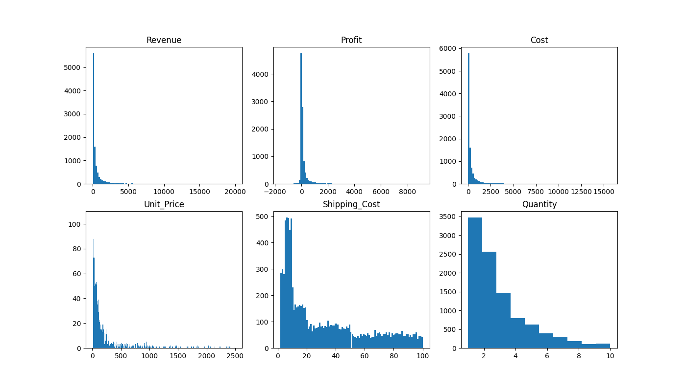
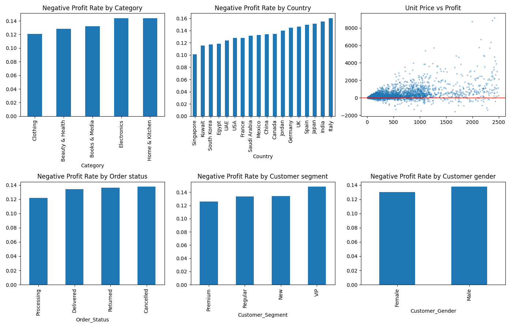
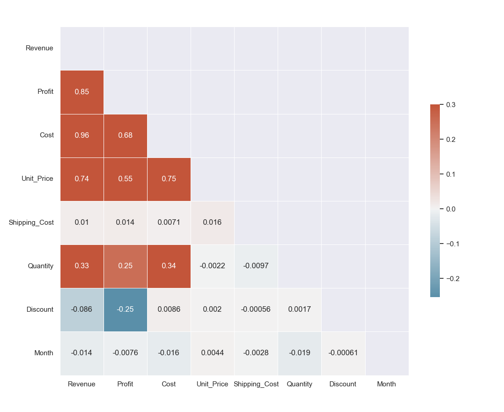
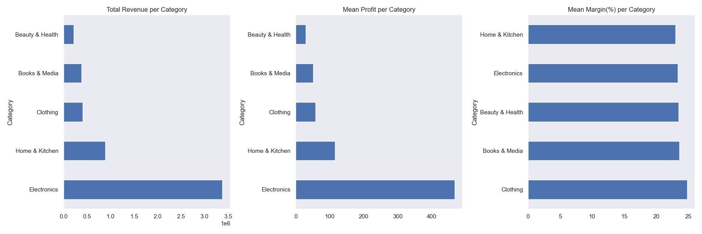
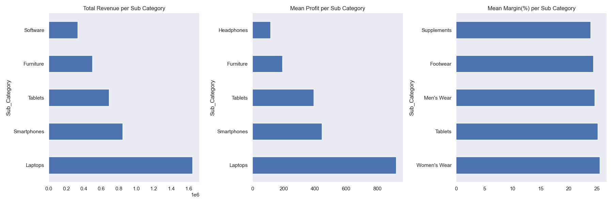
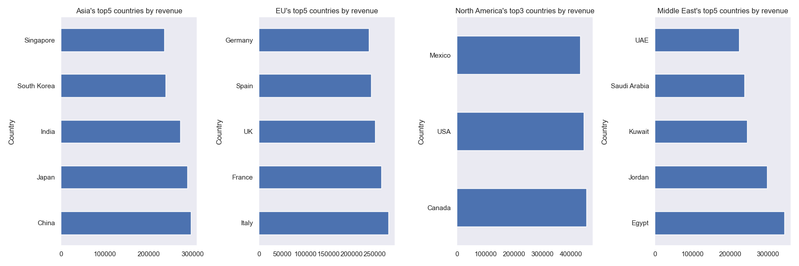
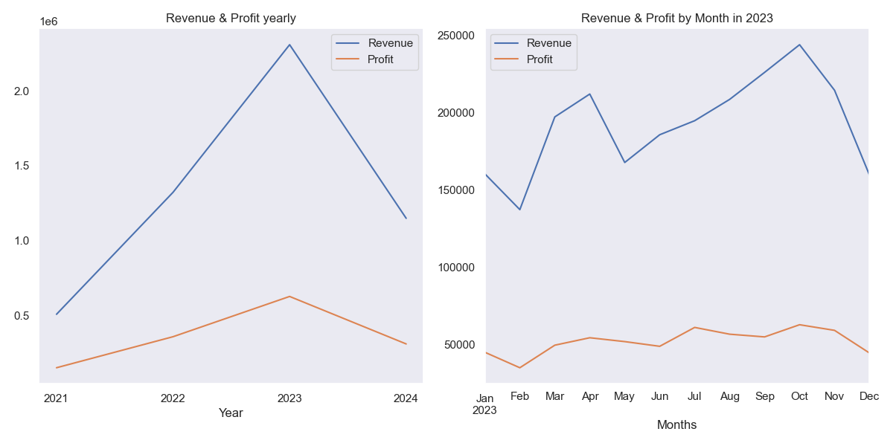
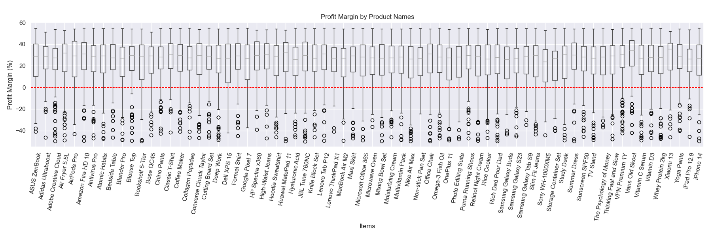
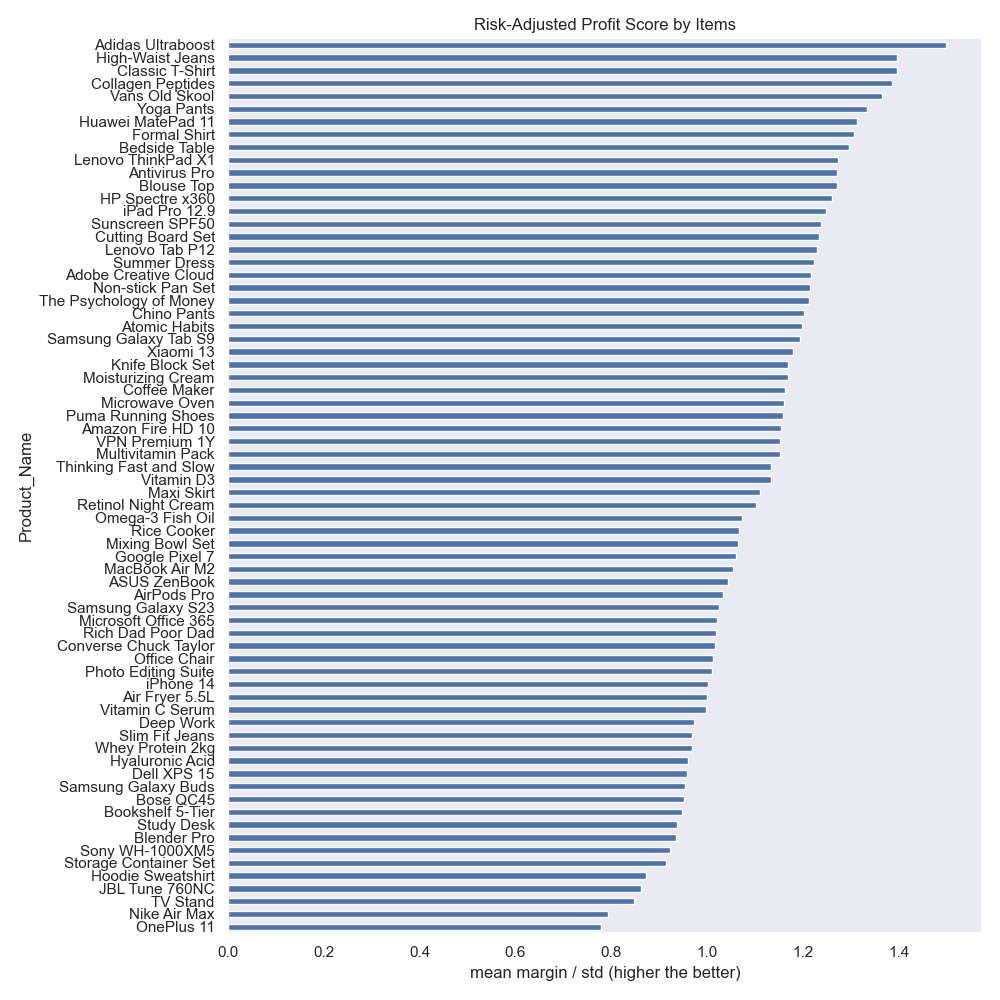

# E-Commerce Sales EDA

Exploratory data analysis on a global e-commerce sales dataset covering 2021 to 2024. The dataset contains order-level records with product, customer, regional, and financial attributes. The goal was to understand the distribution of key metrics, identify patterns in profitability, and evaluate whether any features meaningfully predict outcomes like cancellation or revenue.

Dataset source: [Global E-Commerce Sales Dataset 2021-2024](https://www.kaggle.com/datasets/abdelfattahibrahim/global-e-commerce-sales-dataset-20212024)

---

## 1. Numeric Distributions

Histograms were plotted for Revenue, Profit, Cost, Unit_Price, Shipping_Cost, and Quantity to understand the shape of each column before applying any transforms.

Revenue, Profit, and Cost all show strong right skew, meaning a small number of high-value orders pull the distribution tail to the right. Unit_Price shows a similar pattern. Quantity is relatively uniform. These skewed columns benefit from log compression when used in linear models, though tree-based models are unaffected by scale.

---

## 2. Negative Profit Analysis

Orders with negative profit were isolated and each categorical column was evaluated to see which groups had the highest rate of loss-making orders. The rate was computed as the count of negative profit orders divided by the total orders in each group, rather than raw counts, to account for population differences.

The scatter plot of Unit_Price vs Profit shows losses spread uniformly across all price points, with no concentration in cheap or expensive items. This is consistent with the synthetic nature of the dataset where losses appear to be randomly assigned rather than driven by product or customer attributes.

---

## 3. Correlation Matrix

A Pearson correlation heatmap was computed across all numeric columns: Revenue, Profit, Cost, Unit_Price, Shipping_Cost, Quantity, Discount, and Month.

Revenue and Cost show a strong positive correlation as expected since cost is a component of revenue calculation. Profit correlates moderately with Revenue. Most other pairs show near-zero correlation, including Discount with Revenue, which suggests discounts in this dataset have no meaningful effect on order value.

---

## 4. Revenue and Profit by Category and Sub-Category

Total revenue, mean profit, and mean profit margin were compared across product categories and sub-categories.

Electronics generates the highest total revenue by a significant margin due to higher unit prices. However, mean profit and margin do not differ substantially between categories, which confirms the synthetic nature of the data where margins were likely assigned uniformly.

---

## 5. Regional Revenue Breakdown

The top countries by total revenue were identified within each region: Asia, Europe, North America, and Middle East.

No region shows a dominant country with significantly higher revenue than others within the same region. Revenue is spread across countries relatively evenly, again consistent with synthetic data generation.

---

## 6. Time Series: Revenue and Profit Trends

Annual totals for Revenue and Profit were plotted to see year-on-year trends. Monthly data for 2023 was also plotted to inspect within-year seasonality.

Revenue and Profit trend slightly upward across 2021 to 2024. The monthly breakdown for 2023 shows no strong seasonal peaks, which is unexpected for real e-commerce data where Q4 typically spikes due to holiday shopping. This further supports the conclusion that the dataset was synthetically generated without seasonal patterns embedded.

---

## 7. Profit Margin by Product and Risk-Adjusted Score

Profit margin distribution was plotted per product using box plots. A risk-adjusted score was then computed for each product using the ratio of mean margin to standard deviation of margin, equivalent to a Sharpe ratio. A higher score means a product delivers consistent positive margins relative to its variability.

This is the most actionable analysis for a dropshipper: a product with high mean margin but also high variance is riskier than one with moderate but stable margins. The ranking below shows products sorted by this score.

---

## Conclusions

The dataset is synthetically generated. Statistical tests (ANOVA, t-test, chi-square) found no significant relationship between Order_Status and any feature. Negative profit rates are uniform across all categories, regions, customer segments, and genders. Revenue is almost entirely explained by Category due to price differences between Electronics and other categories, not due to any demand or behavioral pattern.

Despite these limitations, the dataset served as a useful exercise in EDA methodology: distribution analysis, skew detection, population-adjusted rate comparison, correlation analysis, time series visualisation, and risk-adjusted scoring.